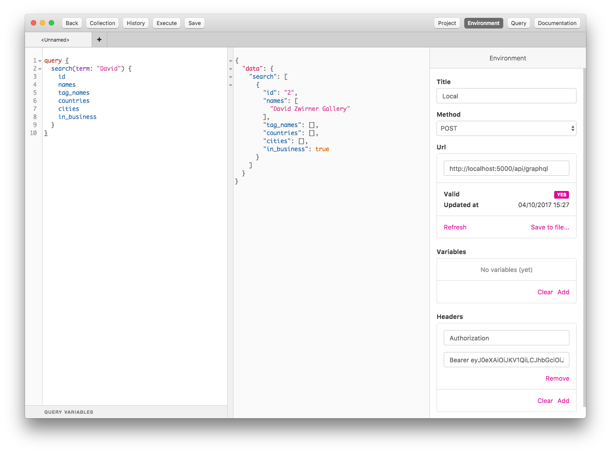

## Bearden API

Bearden implements a GraphQL API.

### Authentication

Trusted apps may use the Bearden API using [JWT](https://jwt.io/)
authentication. You will need to obtain a JWT for Bearden from a Gravity console
on Staging following [the standard process][grav_doc].

Then you can make API calls like this using [graphlient]:

```ruby
url = 'https://bearden-staging.artsy.net' # or production
token = 'shhh' # paste in token from Gravity
client = Graphlient::Client.new(url, headers: { 'Authorization' => "Bearer #{token}" })

# sanity check
client.schema

# search for first 5 modern organizations
response = client.query { query { search(term: "modern", first: 5) { id; name } } }
response.data.search.map(&:name)
 => ["Modern", "Noho Modern", "Katz Modern", "Imitate Modern", "Tate Modern"]
```

### IDE

Use [Graphql IDE][ide]. Create a new project and point the Environment to
`http://localhost:5000/api/graphql` with an `Authorization` header value of
`Bearer <token>`.



[graphlient]: https://github.com/ashkan18/graphlient
[grav_doc]: https://github.com/artsy/gravity/blob/master/doc/ApiAuthentication.md#create-an-app-trust-token
[ide]: https://github.com/andev-software/graphql-ide/releases
